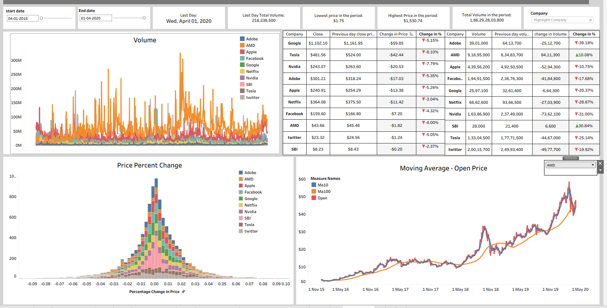

# 📈 Stock Market Dashboard

This project visualizes and analyzes stock market data using Tableau, with data preparation done in Python.

## 🔧 Project Overview

The goal of this project is to gain insights into stock trends, performance over time, and technical indicators through an interactive Tableau dashboard.

- 📊 Data cleaning and transformation: Python (Jupyter Notebook)
- 📈 Dashboard design and interaction: Tableau
- 📁 Files included: Tableau Workbook (`.twb`), Python notebook (`.ipynb`), dashboard screenshot

---

## 🧪 Data Preparation in Python

The notebook [`Stock_Market.ipynb`](Stock_Market.ipynb) handles:

- Loading multiple stock CSV files
- Merging into one combined DataFrame
- Calculating technical indicators:
  - **10-day Moving Average** (`MA10`)
  - **100-day Moving Average** (`MA100`)
- Exporting the cleaned data to Tableau

---

## 📊 Tableau Dashboard

The dashboard visualizes:

- Stock price trends
- Moving average crossovers
- Volume analysis
- Individual stock performance

> Built using `stock market.twb` and designed to be interactive and intuitive for traders and analysts alike.

---

## 🖼️ Dashboard Preview

  
*A snapshot of the interactive Tableau dashboard.*
